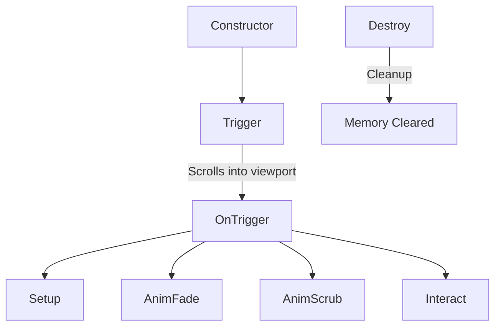

# Standard GSAP Section Animation Guide

This document defines the standard architecture for implementing section-specific JavaScript animations in this codebase. By inheriting from `TriggerSetup`, we ensure that animations are **lazy-initialized** (only initialized when scrolled near the viewport), which guarantees optimal performance and prevents unnecessary resource consumption.

---

## 1. Class Lifecycle Blueprint

Each section module follows a strict lifecycle divided into six major phases:



### Methods Overview

1. **`constructor()`**
   - Initialize instance variables (`this.el`, timers, splits, timelines, event handlers) to `null` or empty arrays. Do not query the DOM here.
2. **`trigger(data)`**
   - Query the main wrapper element. If it exists, call `super.setTrigger(this.el, this.onTrigger.bind(this))` to defer initialization until the section is close to viewport entry.
3. **`onTrigger()`**
   - Called automatically by `TriggerSetup` when the element is scrolled into view. Triggers the core methods in order: `setup()`, `animFade()`, `animScrub()`, and `interact()`.
4. **`setup()`**
   - Prepares DOM states: split texts, initial transformations, CSS properties, etc.
5. **`animFade()`**
   - Sets up autonomous, play-once, or auto-playing animations (such as text rotation loops or entrance fade-ins) that do *not* depend on scroll-scrubbing.
6. **`animScrub()`**
   - Sets up scroll-linked timelines (scrubbing) where GSAP properties are directly bound to the user's scroll progress (e.g., parallax effects, sticky rotations).
7. **`interact()`**
   - Sets up user-driven interactive events, such as tab click handlers, mouse hover events, or form interactive behaviors.
8. **`destroy()`**
   - Crucial for single-page performance. Clean up interactive event listeners, kill timelines, clear intervals/timeouts, revert SplitTexts, and call `super.cleanTrigger()`.

---

## 2. Code Template (Standard Blueprint)

Use the following blueprint when creating a new section module:

```javascript
SectionName: class extends TriggerSetup {
  constructor() {
    super();
    this.el = null;
    this.fadeTl = null;
    this.scrubTl = null;
    this.splits = [];
    this.timer = null;
    this.tabClickHandler = null;
  }

  // 1. Hook into DOM and set up lazy-scroll detection
  trigger(data) {
    this.el = document.querySelector('.my_section_wrap');
    if (!this.el) return;
    super.setTrigger(this.el, this.onTrigger.bind(this));
  }

  // 2. Main lifecycle driver
  onTrigger() {
    this.setup();
    this.animFade();
    this.animScrub();
    this.interact();
  }

  // 3. Prepare elements and apply initial values
  setup() {
    const title = this.el.querySelector('.my_section_title');
    if (title) {
      const split = new SplitText(title, { type: 'chars' });
      gsap.set(split.chars, { yPercent: 100 });
      this.splits.push(split);
    }
  }

  // 4. Autonomous entry animations / loops
  animFade() {
    const chars = this.splits[0]?.chars;
    if (chars) {
      this.fadeTl = gsap.timeline();
      this.fadeTl.to(chars, {
        yPercent: 0,
        duration: 0.8,
        ease: 'power2.out',
        stagger: 0.03
      });
    }
  }

  // 5. Scroll-linked animations (scrubbing)
  animScrub() {
    const bgImage = this.el.querySelector('.my_section_bg img');
    const decoElement = this.el.querySelector('.my_section_deco');

    this.scrubTl = gsap.timeline({
      scrollTrigger: {
        trigger: this.el, // Trigger is the scroll-wrapper
        start: 'top top',
        end: 'bottom bottom',
        scrub: 1,
        invalidateOnRefresh: true
      }
    });

    if (bgImage) {
      this.scrubTl.to(bgImage, {
        scale: 1.1,
        yPercent: 10,
        ease: 'none'
      }, 0);
    }

    if (decoElement) {
      this.scrubTl.to(decoElement, {
        rotation: 180,
        ease: 'none'
      }, 0);
    }
  }

  // 6. User interactive events (tabs, hover, clicks, form validations)
  interact() {
    this.tabClickHandler = function () {
      if ($(this).hasClass('active')) return;
      $('.tab_item').removeClass('active');
      $(this).addClass('active');
    };
    $('.tab_item').on('click', this.tabClickHandler);
  }

  // 7. Complete memory cleanup
  destroy() {
    super.cleanTrigger();

    if (this.tabClickHandler) {
      $('.tab_item').off('click', this.tabClickHandler);
    }
    
    if (this.timer) {
      clearInterval(this.timer);
      this.timer = null;
    }
    
    if (this.fadeTl) {
      this.fadeTl.kill();
      this.fadeTl = null;
    }
    
    if (this.scrubTl) {
      this.scrubTl.kill();
      this.scrubTl = null;
    }

    this.splits.forEach(split => {
      if (split) split.revert();
    });
    this.splits = [];
  }
}
```

---

## 3. Standard Animation Utilities & Orchestration

To maintain a clean, consistent, and highly optimized animation flow, the codebase provides standard utility classes. Always use these utilities instead of creating manual ad-hoc GSAP tweens.

### 1. `FadeSplitText` (Text Splitting)
- **Purpose**: Splitting text into lines, words, or characters, fading and sliding them into view.
- **Features**: Automatically handles parent/child nested masking to avoid page layout shifts, sets correct `overflow: hidden` containers, and aligns gradient background titles (`.cl_linear`) to prevent visual snapping upon reversion.
- **Parameters**:
  - `el`: Target DOM element.
  - `splitType`: `'lines'`, `'words'`, or `'chars'`.
  - `isDisableAnim`: Optional boolean. If `true`, splits the text but defers immediate playback (useful for loop elements).
  - `isDisableRevert`: Optional boolean. Keeps the text split structure instead of calling `revert()` on complete.
- **Usage**:
  ```javascript
  this.titleSplit = new FadeSplitText({ el: titleEl, splitType: 'chars' });
  ```

### 2. `ScaleInset` (Image Reveals)
- **Purpose**: Elegant scale-down image zoom reveals.
- **Usage**:
  ```javascript
  this.imgReveal = new ScaleInset({ el: imgEl, isDisableRevert: true });
  ```

### 3. `FadeIn` (General Opacity/Position Transitions)
- **Purpose**: Standarized entrance transition for non-text/general elements (e.g. SVGs, wrapper blocks, buttons).
- **Parameters**:
  - `el`: Target element or array of elements.
  - `type`: `'bottom'`, `'top'`, `'left'`, `'right'`, `'none'`, or `'default'`.
  - `isDisableRevert`: Optional boolean.
  - `stagger`: Stagger duration.
  - `delay`: Timeline sequence delay (e.g., `'>-=0.3'`).
- **Usage**:
  ```javascript
  this.contentFade = new FadeIn({ el: contentEl, type: 'bottom', isDisableRevert: true });
  ```

### 4. `MasterTimeline` (Orchestration & Synchronization)
- **Purpose**: Combines multiple animation instances (`FadeSplitText`, `ScaleInset`, `FadeIn`) into a single coordinated timeline, handling font readiness asynchronously to ensure layout values are measured correctly.
- **Parameters**:
  - `timeline`: The parent GSAP timeline.
  - `triggerInit`: The ScrollTrigger target element.
  - `tweenArr`: Array of utility class instances.
- **Usage**:
  ```javascript
  const tweenArr = [this.titleSplit, this.imgReveal, this.contentFade];
  this.master = new MasterTimeline({
    timeline: this.fadeTl,
    triggerInit: this.el,
    tweenArr: tweenArr
  });
  ```

### 5. Standard Orchestration Blueprint
Always initialize utility instances inside `setup()` and link them inside `animFade()` via `MasterTimeline` like so:

```javascript
setup() {
  this.title = this.el.querySelector('.title');
  this.img = this.el.querySelector('.img');
  this.content = this.el.querySelector('.content');

  // 1. Initialize all utilities
  if (this.title) this.titleSplit = new FadeSplitText({ el: this.title, splitType: 'chars' });
  if (this.img) this.imgAnim = new ScaleInset({ el: this.img, isDisableRevert: true });
  if (this.content) this.contentFade = new FadeIn({ el: this.content, type: 'bottom', isDisableRevert: true });
}

animFade() {
  // 2. Create parent ScrollTrigger timeline
  this.fadeTl = gsap.timeline({
    scrollTrigger: {
      trigger: this.el,
      start: 'top top+=75%',
      once: true
    }
  });

  // 3. Orchestrate with MasterTimeline
  this.master = new MasterTimeline({
    timeline: this.fadeTl,
    triggerInit: this.el,
    tweenArr: [this.titleSplit, this.imgAnim, this.contentFade]
  });
}

destroy() {
  // 4. Clean up all resources
  super.cleanTrigger();
  if (this.fadeTl) { this.fadeTl.kill(); this.fadeTl = null; }
  if (this.master) { this.master.destroy(); this.master = null; }
  if (this.titleSplit) { this.titleSplit.destroy(); this.titleSplit = null; }
  if (this.imgAnim) { this.imgAnim.destroy(); this.imgAnim = null; }
  if (this.contentFade) { this.contentFade.destroy(); this.contentFade = null; }
}
```

